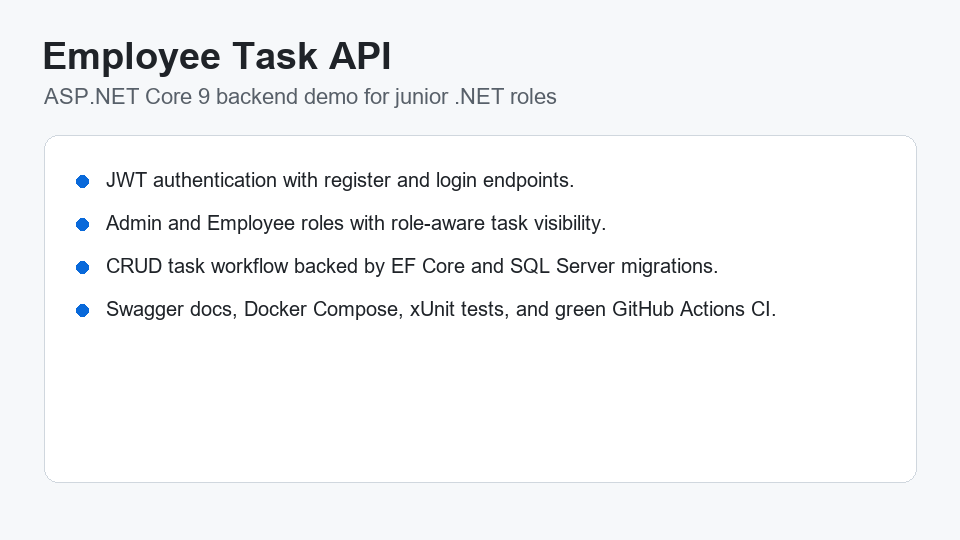
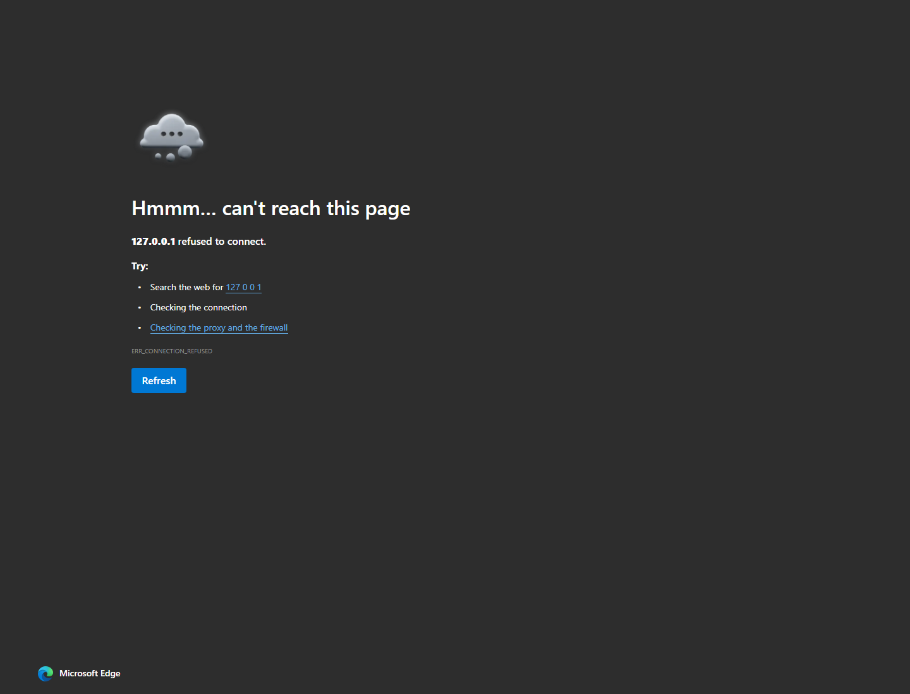

# Employee Task API

[](https://github.com/NEMZ11/employee-task-api/actions/workflows/ci.yml)

ASP.NET Core 9 Web API for managing employee tasks with JWT authentication, role-based access, Entity Framework Core, SQL Server, Swagger, xUnit tests, Docker, and GitHub Actions CI.

## Demo



## Problem

Small teams need a simple way to assign, track, and update employee work without exposing every task to every user. This API demonstrates the backend foundations expected in a junior .NET role: secure login, CRUD endpoints, SQL persistence, role-aware authorization, automated tests, and CI.

## Features

- Register and log in users with hashed passwords.
- Issue JWT bearer tokens for authenticated API access.
- Support `Admin` and `Employee` roles.
- Create, read, update, and delete tasks.
- Restrict employees to tasks they created or were assigned.
- Let admins view and manage all tasks.
- Persist data with EF Core and SQL Server.
- Explore and test endpoints through Swagger UI.
- Run unit tests with xUnit.
- Build and run with Docker Compose.

## Tech Stack

- C# / ASP.NET Core 9
- Entity Framework Core 9
- SQL Server
- JWT Bearer Authentication
- Swagger / OpenAPI
- xUnit
- Docker
- GitHub Actions

## Architecture

```text
src/EmployeeTaskApi.Api
|-- Contracts      Request/response DTOs
|-- Data           EF Core DbContext
|-- Domain         User, role, and task entities
|-- Endpoints      Minimal API route groups
|-- Services       Auth, password, JWT, and task business logic

tests/EmployeeTaskApi.Tests
|-- Service-level unit tests using EF Core InMemory
```

## API Endpoints

| Method | Endpoint | Auth | Description |
| --- | --- | --- | --- |
| POST | `/api/auth/register` | No | Create a user account |
| POST | `/api/auth/login` | No | Log in and receive a JWT |
| GET | `/api/tasks` | Yes | List visible tasks |
| GET | `/api/tasks/{id}` | Yes | Get one task |
| POST | `/api/tasks` | Yes | Create a task |
| PUT | `/api/tasks/{id}` | Yes | Update a task |
| DELETE | `/api/tasks/{id}` | Yes | Delete a task |

## Quick Start

### Run with Docker Compose

```bash
docker compose up --build
```

Open Swagger:

```text
http://localhost:8080/swagger
```

### Run Locally

Update the `DefaultConnection` value in `src/EmployeeTaskApi.Api/appsettings.json` if your SQL Server credentials are different.

```bash
dotnet restore
dotnet build
dotnet ef database update --project src/EmployeeTaskApi.Api --startup-project src/EmployeeTaskApi.Api
dotnet run --project src/EmployeeTaskApi.Api
```

## Example Requests

Register:

```json
{
  "fullName": "Admin User",
  "email": "admin@example.com",
  "password": "Passw0rd!",
  "role": "Admin"
}
```

Create a task:

```json
{
  "title": "Prepare sprint report",
  "description": "Summarize completed work and blockers",
  "dueDate": "2026-07-10",
  "assignedToId": 2
}
```

Update a task:

```json
{
  "title": "Prepare sprint report",
  "description": "Include burndown notes",
  "status": "InProgress",
  "dueDate": "2026-07-10",
  "assignedToId": 2
}
```

## Tests

```bash
dotnet test
```

Current coverage focuses on password hashing and task visibility rules. Good next tests would cover endpoint-level auth behavior with `WebApplicationFactory`.

## Screenshots

Swagger UI:



Recommended next screenshots after the first GitHub run:

- GitHub Actions green CI run.
- Authenticated task CRUD request with a bearer token.

## Future Improvements

- Add database migrations and automatic startup migration in development.
- Add refresh tokens.
- Add pagination and filtering for task lists.
- Add endpoint integration tests.
- Add audit history for task updates.
